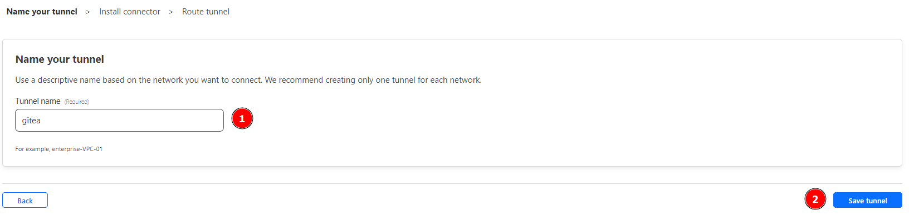

# A Dissertation Concerning Docker’s Superiority
Feat. Shalom

## An Intro to Docker


### Pros & Cons of Docker
Pros: Simplifies the way software is packaged and deployed, making it easier to share and run applications reliably across different systems.
Cons: Complex to understand and manage.
May not be suitable for certain types of applications that have specific security or performance needs.


### Docker Lingo
<u>**Docker**</u>: An open-source platform that allows you to automate the deployment and management of applications within containers.

<u>**Container**</u>: A lightweight, isolated environment that encapsulates an application and its dependencies, allowing it to run consistently across different systems.

<u>**Image**</u>: A read-only template used to create Docker containers. It contains the application code, runtime, libraries, and dependencies required to run an application.

<u>**Containerization**</u>: The process of creating containers using technologies like Docker to package applications with their dependencies.

<u>**Dockerfile**</u>: A text file that contains instructions on how to build a Docker image. It specifies the base image, dependencies, configuration, and commands needed to create the image.

<u>**Pull**</u>: The process of downloading a Docker image from a registry to a local machine.

<u>**Push**</u>: The process of uploading a Docker image from a local machine to a registry.

<u>**Tag**</u>: A label attached to a Docker image that represents a specific version or variant of the image. Tags are used to differentiate between different versions of an image.

<u>**Container Orchestration**</u>: The management and coordination of multiple Docker containers across a cluster of machines. Kubernetes is a popular container orchestration platform.

<u>**Service**</u>: A Docker object used in container orchestration platforms to define a desired state for running containers, such as the number of replicas, networking, and resource allocation.

<u>**Volume**</u>: A Docker feature that allows you to persist data generated by containers. Volumes can be shared between containers and can exist independently of containers' lifecycle.

<u>**Networking**</u>: Docker provides various networking options to allow containers to communicate with each other and with the outside world. Docker networks can be created to isolate or connect containers.

<u>**Compose**</u>: Docker Compose is a tool for defining and running multi-container Docker applications. It uses a YAML file to define the services, networks, and volumes required for an application.

### Dockerfile Instructions Cheat Sheet
<u>**FROM**</u>: Specifies the base image for your Docker image. Example: FROM ubuntu:latest (Sets the base image as the latest version of Ubuntu)

<u>**RUN**</u>: Executes a command in the Docker image during the build process. Example: RUN apt-get update && apt-get install -y package_name (Runs an update and installs a package in the Docker image)

<u>**COPY or ADD**</u>: Copies files or directories from the host machine to the Docker image. Example: COPY src_dir dest_dir (Copies the files/directories from the source directory on the host to the destination directory in the image)

<u>**WORKDIR**</u>: Sets the working directory for subsequent instructions. Example: WORKDIR /app (Sets the working directory as '/app' inside the Docker image)

<u>**EXPOSE**</u>: Specifies the network ports that the container listens on at runtime. Example: EXPOSE 8080 (Informs Docker that the container listens on port 8080)

<u>**CMD**</u>: Defines the default command to be executed when the container starts. Example: CMD ["executable", "param1", "param2"] (Sets the command and its parameters to be executed when the container starts)

<u>**ENTRYPOINT**</u>: Configures the container to run as an executable. Example: ENTRYPOINT ["executable", "param1", "param2"] (Sets the entrypoint command and its parameters)

<u>**ENV**</u>: Sets environment variables in the Docker image. Example: ENV MY_VAR=value (Sets the environment variable 'MY_VAR' to 'value')

<u>**VOLUME**</u>: Creates a mount point and assigns it to a volume. Example: VOLUME /data (Creates a volume and assigns it to the '/data' directory in the container)

### Common Docker Commands
docker <u>**run**</u>: Creates and starts a new container based on a specified image. Example: docker run nginx (Runs an instance of the Nginx web server)

docker <u>**stop**</u>: Stops a running container. Example: docker stop container_name (Stops a container with the specified name)

docker <u>**start**</u>: Starts a stopped container. Example: docker start container_name (Starts a container with the specified name)

docker <u>**restart**</u>: Stops and starts a container. Example: docker restart container_name (Restarts a container with the specified name)

docker <u>**ps**</u>: Lists running containers. Example: docker ps (Lists all running containers)

docker <u>**ps -a**</u>: Lists all containers (including stopped containers). Example: docker ps -a (Lists all containers, both running and stopped)

docker <u>**images**</u>: Lists available Docker images. Example: docker images (Lists all downloaded Docker images)

docker <u>**pull**</u>: Downloads a Docker image from a registry. Example: docker pull image_name (Downloads the specified Docker image)

docker <u>**rmi**</u>: Removes a Docker image. Example: docker rmi image_name (Removes the specified Docker image)

docker <u>**rm**</u>: Removes a container. Example: docker rm container_name (Removes the specified container)

docker <u>**exec**</u>: Runs a command in a running container. Example: docker exec -it container_name command (Runs the specified command inside the container)

docker <u>**build**</u>: Builds a Docker image from a Dockerfile. Example: docker build -t image_name . (Builds a Docker image with the specified name using the Dockerfile in the current directory)

### Docker Compose
- You may need to use multiple containers
- Manage them all with Docker Compose
- No need to write out every command for every container
- Here is an example of what it looks like:


## Installing Docker
We need to install some useful extensions to use Docker in VSCode. Navigate to your Extensions panel and do so:


Open Docker Desktop


When we head back to VSCode there is a high likelihood that we still can't see Docker. 
If that is the case it would look like this:

Just close and reopen VSCode to solve this problem


For Windows users, it may be required to update wsl after you install your extensions.
Type the following in your terminal to reflect these changes:
```shell
wsl --update
```

**NOTE** for some older hardware, it may be required to enable Hardware Virtualization. You can tell if this error 
appears:

Unforgettably to enable this it is different on every machine so look up how to change it for your make/model. 
It will require you to change something in your BIOS.

## Trying out Docker
We have created a standard Python file that contains a small number guessing game. We can *deploy* this to a container

Firstly make sure that you are inside the game_example dir:
```shell
cd game_example
```
Next we will want to build the image:
```shell
docker build -t game .
```
A small explanation of what is going on here. docker build will find your Dockerfile and follow the instructions in it 
to create an image. the -t game provides a tag to that image. Tags are a great way to know what your image is at a 
quick glance. If we do not tag it, it will be a hash such as "5a995114d845". Lastly the . just tells docker where to 
look for the Dockerfile

Now we can run the docker image and therefore run the python code by using this:
```shell
docker run -it --name do-container game
```
Here we are running the image we just created. So if you named your image something other than game, you would do that
name at the end instead. The -it allows us to open a shell in interactive mode for that container. This allows us to 
provide user input for our example. The --name flag is similar to the tagging we did above but instead we are naming our
container. If we do not specify a container name it will be a random string such as "hasty-rhino".

 
Now you should see some stuff in the console at this point, just play around with the game until you guess correctly!

## Docker Compose Example
A ton of people find docker compose to be more useful and easier to use so we will use that for the rest of the 
examples. Instead of CLI application, we are going to be hosting our own git server. Think of it like your own local 
GitHub! And a bit later I will be showing you how to publish to the web as well :)

To start, change your current dir to gitea:
```shell
cd gitea
```
Make sure you are in the root docker-by-example dir when you execute the above.

Now we can start our container:
```shell
docker-compose up -d
```
This is just slightly different syntax from the Dockerfile example above, but it does the same thing.
The -d flag provides a detached version of the container, meaning our code runs in the background.
We can visit our Gitea instance by visiting https://localhost:3000

From here follow the images shown below.
Scroll to the bottom of the page and click here:


### Exposing Gitea to the web
**NOTE** unless you have a domain name the rest of this example won't be possible. Feel free to just read/follow along.

Great we have Gitea installed and setup. It would work great like this, but we can take it a step further and let other 
people discover our projects by exposing this behind a reverse proxy. We won't go into too much depth here but a reverse
proxy is just a way to take a local application and publish it the web.

Some of you may have noticed a lingering part of our docker-compose.yml file. We have another service running beneath
gitea:


This is a service called cloudflare. It is very well known and runs most of the web because it's great DDoS protection 
and ease of use. To make this work we need to transfer our domain to Cloudflare and setup some simple DNS records.
After this, we can now set up a easy tool called Cloudflare Tunnels. This is the reverse proxy I was mentioning before.
We need to navigate to the Zero Trust Portal:
https://one.dash.cloudflare.com

We can create a new tunnel by clicking here:


After giving your tunnel a name, we need to grab the tunnel token. This allows anyone to use your tunnel so keep it a 
secret:



We need to add that to the docker-compose.yml file where it says TUNNEL_TOKEN.
We'll need to restart our container to make the changes:
```shell
docker-compose restart tunnel
```
Navigating back to your tunnels you can see a valid connector:


Let's move on to setting up a DNS record for this app. Copy these settings. Make sure to replace domain with your domain.


After saving these settings we can go to that url and **BOOM!**. You've just successfully setup a public alternative to 
GitHub.

Docker can be a bit challenging at the beginning but it is really neat tool to help you and your company!